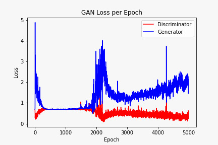
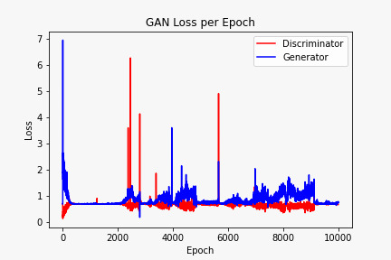
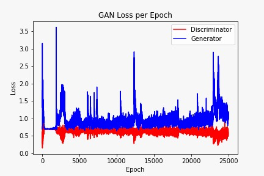

# Objective
 In this project, our goal is to explore the use of LSTM and GAN neural networks to generate music that seems as if it were human-made.

## Data Collection & Processing

  We wanted a relatively simple corpus of piano music to train and learn from. Additional criteria that would make the project more feasible in our time frame included finding tracks that were homogenous in genre and pattern, as well as tracks that avoided pauses. This is simply because we did not know how the models would handle note-less space while learning patterns. A set of 100 Super Mario tracks (in piano only) were selected from this online collection of MIDI files. The corpus contains solely background music (meaning no pauses).\
\
Here is a sample midi file ....


```
We used Music21, a library to extract the relevant information from the MIDI files. Music21 allows us to read each track’s notes and chords (groups of notes) into Python while maintaining their sequence. Each note is represented as its specific note-type or a corresponding number.


## Music Generation

For the LSTM network, we sample a random 100 note sequence from the corpus and input that into the network and have it make a prediction, which is our encoded output. For the GAN network, we feed the generator a random sequence of numbers sampled from a standard normal distribution and passed to discriminator as set of fake data, this trains both generator and discriminator. We can use Music21 to turn our predicted sequences into brand new MIDI files.


## 3 Phase Training

* In first phase, we train our model with 2500 epoch, In this phase performance of generator as well as discriminator was so poor.


<p align="center">
    
</p>


* In the second phase, we train our model with 5000 epoch, In this performance of discriminator was increased but generator still not able to produce good music.

<p align="center">
    
</p>


* In the last phase generator produces a new music that seems as if it were human-made.
 ,Both gives the best performance.


 <p align="center">
     
 </p>

## Results

Here is our newly generated midi file ...

file
```


## Authors

* *Nirav Madhani (18bce135)*
* *Nisarg Patel (18bce136)*
* *Nikhil Rajput (18bce192)*
